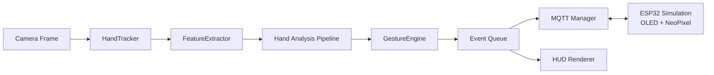
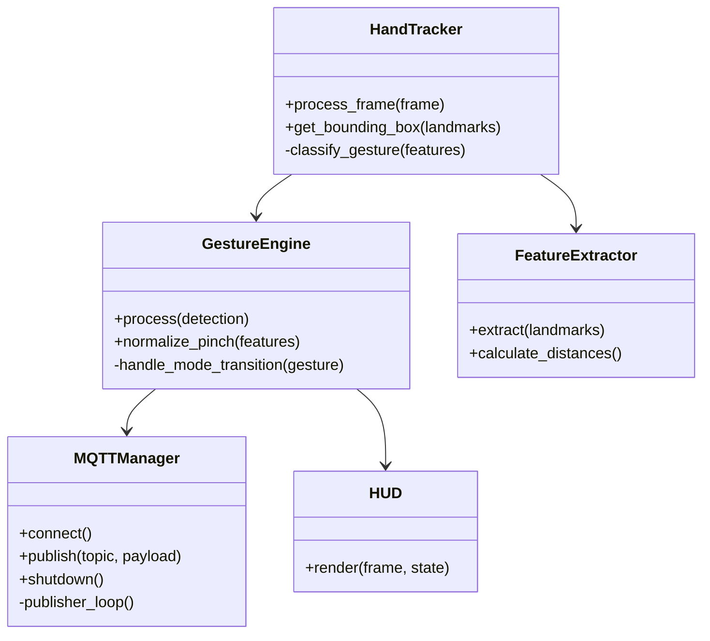
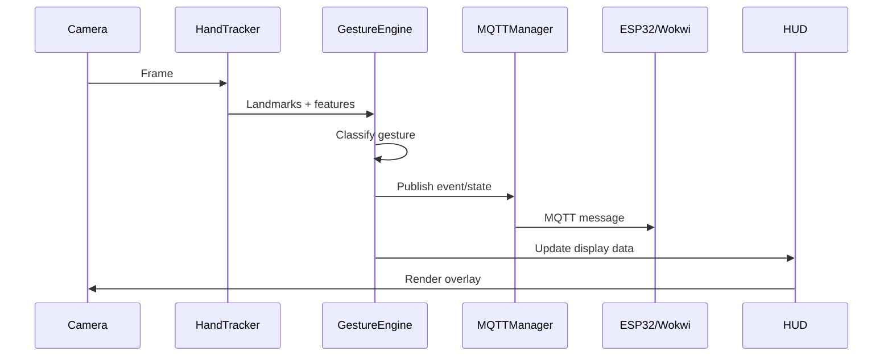
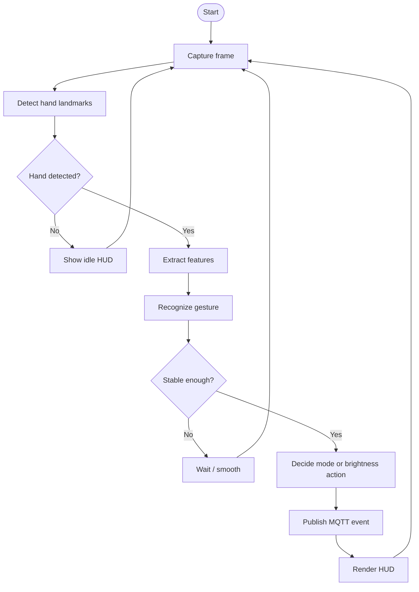

# 🌌 Nebula Interface

## Advanced Hand Gesture Recognition for IoT Control

<!-- markdownlint-disable -->


Nebula Interface is a real-time hand gesture recognition system that turns webcam input into MQTT events for lighting and device control. It combines computer vision, event-driven architecture, and ESP32 simulation to create a practical IoT demo that is easy to learn from and strong enough to showcase in a portfolio.

## Why this project matters

This project is built as a learning-friendly reference, not just a demo. It shows how to connect vision, logic, and hardware in a clean way, and it explains the decisions behind the implementation so others can reuse the same patterns in their own projects.

If you are building a portfolio, this project demonstrates:

- Real-time computer vision with MediaPipe and OpenCV
- Event-driven software design with threading and queues
- MQTT-based IoT communication
- Clean configuration and error handling
- A complete developer workflow: setup, testing, logging, troubleshooting, and simulation

## What you can say on LinkedIn

You can describe this project with statements like:

- Built a real-time hand gesture recognition system using Python, OpenCV, and MediaPipe
- Designed an event-driven IoT control pipeline using MQTT and ESP32 simulation
- Implemented gesture smoothing, mode switching, and brightness control for touchless interaction
- Improved reliability with structured logging, retry logic, and graceful shutdown handling
- Created a production-ready developer experience with setup automation, diagnostics, and documentation

## Skills gained from this project

- Computer vision pipeline design
- Hand landmark processing and gesture classification
- State machines and event-driven architecture
- MQTT publish/subscribe communication
- Threading and background worker design
- Debugging and observability with logs
- Configuration management
- Simulation-based IoT testing
- Technical documentation writing
- System integration across software and embedded targets

## What makes this README useful

Many YouTube tutorials show the “happy path” only. This README is written to help you actually understand the system, avoid common mistakes, and build the project correctly the first time.

It explains:

- What each module does
- Why the architecture is structured this way
- How the hand gestures map to system states
- Why the chosen thresholds and cooldowns are used
- What common tutorial shortcuts are wrong or incomplete
- How to verify that the system is really working

---

## Overview

**Nebula Interface** uses:

- **Computer Vision**: MediaPipe for hand tracking
- **Gesture Logic**: Gesture recognition and mode transitions
- **MQTT**: Real-time messaging to devices
- **ESP32**: Hardware simulation in Wokwi
- **OLED + NeoPixel**: Visual feedback for mode and brightness

The system is designed around a simple idea: detect a gesture, turn it into a stable event, publish that event, and let the display or hardware react.

---

## Features

- Real-time hand tracking at high frame rates
- Gesture recognition for Peace, Fist, Open Hand, One, and Pinch
- Mode switching between IDLE, LIGHTING, MEDIA, and MOUSE
- Pinch-based brightness control from 0% to 100%
- MQTT integration for external device control
- Smooth gesture filtering to reduce jitter
- Safe shutdown and reconnect logic
- Structured logs for easier debugging
- Wokwi-based ESP32 simulation for reproducible testing

---

## System Design

The project is organized as a pipeline with explicit boundaries:

- Capture and detect hands
- Extract features from landmarks
- Run analysis and classification in a dedicated pipeline
- Turn the analysis into mode and brightness decisions
- Publish events and render the HUD

This is intentionally closer to a MediaPipe-style graph than a monolithic loop.



### Design Principles

- Keep frame capture, analysis, decision making, and transport separate.
- Prefer typed data boundaries over shared mutable state where possible.
- Treat calibration, motion gestures, and AI refinement as an analysis layer, not as camera logic.
- Keep the main loop as a composition root only.
- Use MQTT as a delivery channel, not as a place where gesture logic lives.

### UML Class Diagram



### UML Sequence Diagram



### UML Activity Diagram



---

## How it works

1. The camera captures a frame.
2. MediaPipe finds hand landmarks.
3. Features are extracted from the landmarks.
4. Gesture logic classifies the current hand pose.
5. The system smooths the result to avoid false positives.
6. If the gesture is valid, the system publishes an MQTT message.
7. The HUD updates the screen with state, mode, gesture, and brightness.
8. The ESP32 simulation reacts through OLED and NeoPixel output.

## Calibration and local training

The project now includes a calibration workflow for building user-specific prototypes from your own hand samples.

### Runtime controls

- `k` toggles calibration capture on or off
- `1` to `5` selects the target label while capture is active
- `r` clears collected calibration samples

### Calibration labels

| Key | Label |
|-----|-------|
| 1 | FIST |
| 2 | ONE |
| 3 | PEACE |
| 4 | OPEN |
| 5 | PINCH_READY |

### Build prototypes from samples

After collecting samples, generate runtime prototypes with:

```bash
python scripts/build_calibration_prototypes.py
```

This creates `configs/calibration_prototypes.json`, which the local AI loader will use automatically when present.

---

## Gestures

| Gesture | Meaning | Result |
|---------|---------|--------|
| Peace ✌️ | Activation gesture | Switch to LIGHTING |
| Fist ✊ | Stop gesture | Return to IDLE |
| Open Hand | Control gesture | Switch to MEDIA |
| Pinch 🤏 | Continuous control | Adjust brightness |
| One ☝️ | Optional navigation | MOUSE / selection use cases |

---

## MQTT Topics

- `nebula/system/status` - Current system state
- `nebula/gestures/events` - Gesture events
- `nebula/lighting/control` - Lighting control values

These topics keep the UI and device logic separated. That separation is important because it makes the system easier to debug, test, and extend.

---

## Project Structure

```text
nebula-interface/
├── main.py
├── config.py
├── setup.py
├── test_system.py
├── README.md
├── TROUBLESHOOTING.md
├── QUICK_START.md
├── FINAL_CHECKLIST.md
├── COMPLETION_REPORT.md
├── requirements.txt
├── configs/
│   └── config.json
├── communication/
│   └── mqtt_handler.py
├── vision/
│   ├── hand_tracker.py
│   ├── gesture_engine.py
│   ├── feature_extractor.py
│   ├── smoothing.py
│   └── hud.py
├── utils/
│   ├── helpers.py
│   └── logger.py
├── assets/
│   └── screenshots/
└── logs/
```

---

## Tech Stack

| Layer | Technologies |
|-------|--------------|
| Vision | Python, OpenCV, MediaPipe |
| Processing | Feature extraction, smoothing, normalization |
| Architecture | Threading, queue, state machine |
| Communication | MQTT with paho-mqtt |
| Embedded | ESP32, Wokwi, SSD1306 OLED, NeoPixel |
| Tools | VS Code, Git, logging, testing |

---

## Installation

### Recommended setup

```bash
python setup.py
```

### Manual setup

```bash
pip install -r requirements.txt
```

Then run the system test:

```bash
python test_system.py
```

You should see all tests pass before you start `main.py`.

---

## Quick Start

### 1. Start Mosquitto

```bash
mosquitto -v
```

### 2. Run Wokwi

1. Open [wokwi.com](https://wokwi.com)
2. Create a new project
3. Select ESP32 DevKit V1
4. Add SSD1306 OLED and WS2812B NeoPixel
5. Wire the components correctly
6. Paste the ESP32 code
7. Start simulation

### 3. Run the Python app

```bash
python main.py
```

Shortcuts:

- `q` = quit
- `d` = debug mode
- `c` = frame count

---

## Configuration

Edit `configs/config.json` to adjust:

- camera resolution
- detection thresholds
- gesture cooldowns
- UI colors
- smoothing settings

Example:

```json
{
  "camera": {"width": 1280, "height": 720, "fps": 30},
  "hand": {"min_detection_confidence": 0.7, "min_tracking_confidence": 0.7},
  "gestures": {"cooldown_event": 0.65, "cooldown_continuous": 0.08}
}
```

---

## Why these implementation choices are correct

### 1. Normalized pinch control
Using pinch distance relative to palm size is better than using raw pixel distance because it works across different camera distances and hand sizes.

### 2. Gesture smoothing
Real hands are noisy. Smoothing reduces flicker and prevents accidental state changes.

### 3. MQTT in a background thread
Network calls should not block the vision loop. A background publisher keeps the UI responsive.

### 4. State machine for modes
Mode-based logic is easier to understand and extend than one large if/else chain.

### 5. Logging and diagnostics
Logs make the project maintainable. If something fails, you can trace it quickly.

---

## Common YouTube mistakes and why this project avoids them

### Mistake 1: Using raw pinch distance only
Many tutorials compare two landmark coordinates directly and call it done. That breaks when the hand moves closer or farther from the camera. This project normalizes pinch distance against palm size so the value is more stable.

### Mistake 2: No smoothing
Without smoothing, the gesture can flip between states every frame. Here, smoothing helps keep the output stable and usable.

### Mistake 3: Blocking MQTT calls inside the main loop
Some tutorials publish directly in the frame-processing loop. That can freeze the camera pipeline. This project uses a background publisher thread instead.

### Mistake 4: No graceful shutdown
If the app closes without cleanup, camera and MQTT resources can remain in a bad state. This project closes everything cleanly.

### Mistake 5: No configuration file
Hard-coded thresholds make tuning painful. This project keeps settings in `config.json` so you can adjust behavior without rewriting code.

### Mistake 6: No verification step
Skipping a system test wastes time. Here, `test_system.py` verifies the environment before runtime issues appear.

### Mistake 7: No explanation of why the thresholds exist
Many tutorials show numbers without context. This README explains the purpose of confidence thresholds and cooldowns so you can tune them intelligently.

---

## What you learn from this project

If you build this project carefully, you will learn:

- How a real-time vision pipeline is structured
- How gesture recognition becomes an event system
- How to use MQTT for device communication
- How to design a state machine for user interaction
- How to make a project robust with logging and retries
- How to document a project so others can learn from it

---

## LinkedIn-ready skills

Use these skill statements in your profile or post:

- Real-time computer vision
- Gesture recognition using MediaPipe
- Python application architecture
- MQTT and IoT communication
- Event-driven programming
- Threading and asynchronous task separation
- Debugging and observability
- Technical documentation and developer experience
- ESP32 simulation and embedded integration
- Problem solving and systems integration

---

## Portfolio value

This project is strong for a portfolio because it shows more than code. It shows a complete engineering workflow:

- Problem definition
- System design
- Implementation
- Simulation
- Testing
- Debugging
- Documentation
- User education

That combination makes the project more credible than a simple tutorial clone.

---

## Troubleshooting

See [TROUBLESHOOTING.md](TROUBLESHOOTING.md) for detailed solutions.

Quick checks:

```bash
python test_system.py
mosquitto -v
```

If gestures are unstable:

- improve lighting
- keep your hand centered
- slow down the gesture
- press `d` for debug mode

---

## Screenshots and demo

Add real screenshots of:

- the live HUD
- Peace gesture activation
- Brightness control with pinch
- Wokwi OLED output
- NeoPixel feedback

Add a demo video link after recording your run.

---

## Future roadmap

- Add multiple-hand support
- Add custom gestures
- Improve analytics and logging
- Export event history
- Add a desktop control panel
- Deploy to real ESP32 hardware

---

## Final notes

This project is intentionally written so a beginner can follow it and an experienced developer can still extract architectural value from it. The goal is not only to make the system work, but to make it understandable and reusable.

If you want, you can use this README as a template for future AI, IoT, or computer vision projects.

---

**Developed with ❤️ by [Your Name]**


<!-- markdownlint-enable -->
